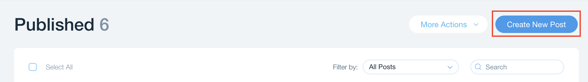
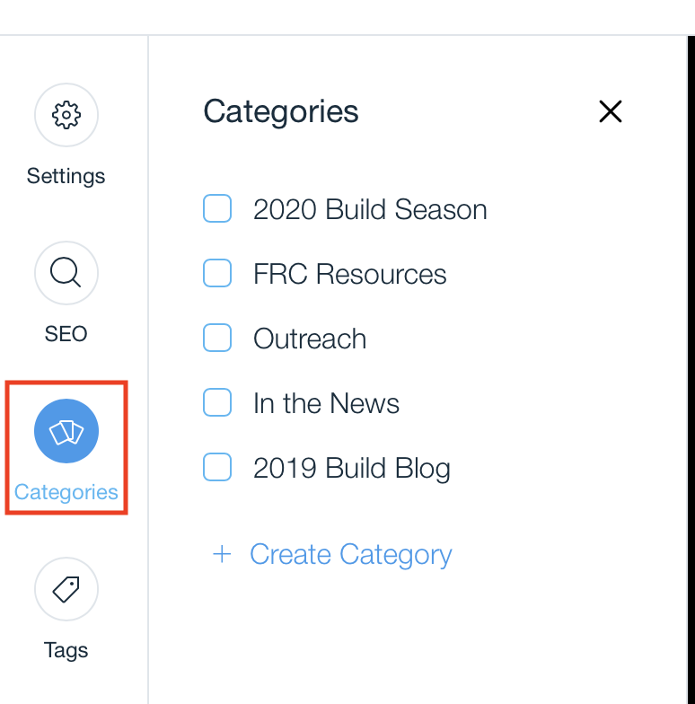
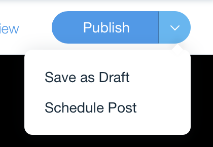
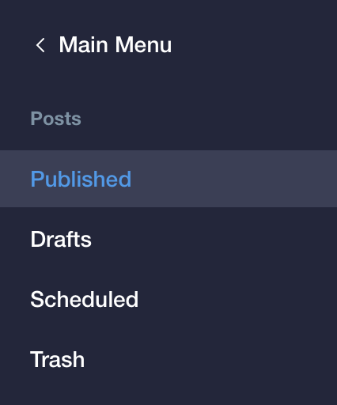

# Updating the Blog

1. [Login](logging_in.md)
2. Select **Blog** from the sidebar:  
   

## Creating New Posts

1. Select **Create New Post**:  
   
2. In the side bar select **Categories** and choose the correct category for the type of post:  
   
3. Write your post title
4. Write your post contents
5. Attached a video and/or photo to the post.
6. Click **Publish** or the arrow next to publish to **Schedule the post**:  
   

## Editing Existing Posts or Draft

1. Select the post type you would like to edit from the side bar:
   
2. Click on the **post title** or the **edit** button:  
   
3. Continue to [create the post](#creating-new-posts)
