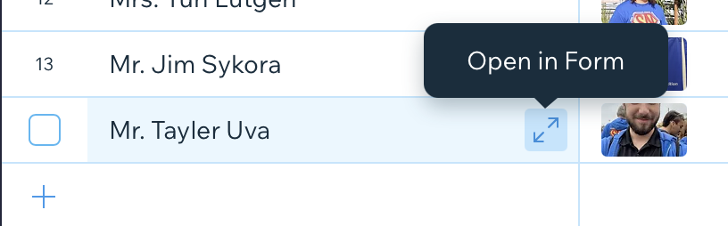

# Updating Dynamic Pages

1. [Login](logging_in.md)
2. Select **Content Manager** from the sidebar:  
   

## Yearly updates

1. New Season needs to be added to the **Past Seasons** collection.
2. Active mentors (**Mentor** Collection) need to have new tag added for the new season year (**Years Mentored** Column).
3. Active students (**Student** Collection) need to have new tag added for the new season year (**Years Active** Column).
4. New students need to be added (**Student** Collection).
5. Graduated students (**Student** Collection) need to have
   1. College added **College** Column)
   2. Majors added (**Major** Column)
   3. New tag added for graduation date (**Graduation Year** Column)
6. Update the "#### Season" link to the new year
   1. Rename to new year
   2. Change link to new year item

## Editing a Collection

1. Select a collection:  
   

### Adding a new item

1. Click **+ New Item** (form mode) or scroll to the bottom and click **+** (spreadsheet mode):  
     
   or  
   
2. Fill in the the fields for the new item.

### Editing an item

You can either edit the item in [spreadsheet mode](#spreadsheet-mode) or [form mode](#form-mode):

#### Spreadsheet Mode

1. Select the cell of the desired item.
2. Change the cell contents.

#### Form Mode

1. Click the expand icon (hover over the first column in a row to make it appear)

2. Change the desired fields in the form
