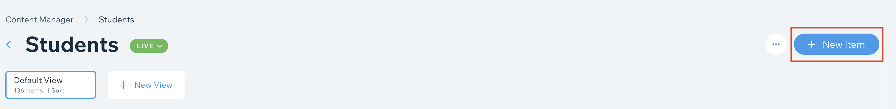

# Updating Dynamic Pages

1. [Login](logging_in.md)
2. Select **Content Manager** from the sidebar:  
   

## Yearly updates

1. New Season needs to be added to the **Past Seasons** collection.
2. Active mentors need to have new tag added for the new season year (**Years Mentored** Column).
3. Active students need to have new tag added for the new season year (**Years Active** Column).
4. New students need to be added.
5. Majors and colleges of graduated students need to be added.

## Editing a Collection

1. Select a collection:  
   

### Adding a new item

1. Click **+ New Item** or scroll to the bottom and click **+**:  
     
   or  
   
2. Fill in the the columns for the new item.

### Editing an item

1. Select the cell of the desired item.
2. Change the cell contents.
